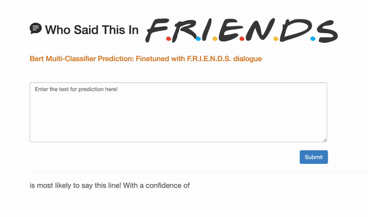
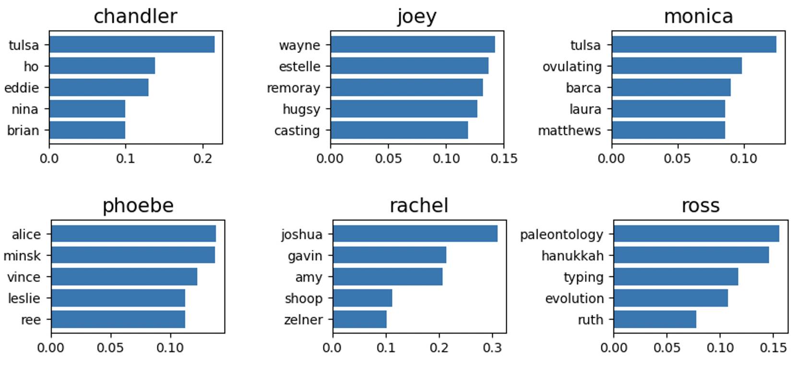
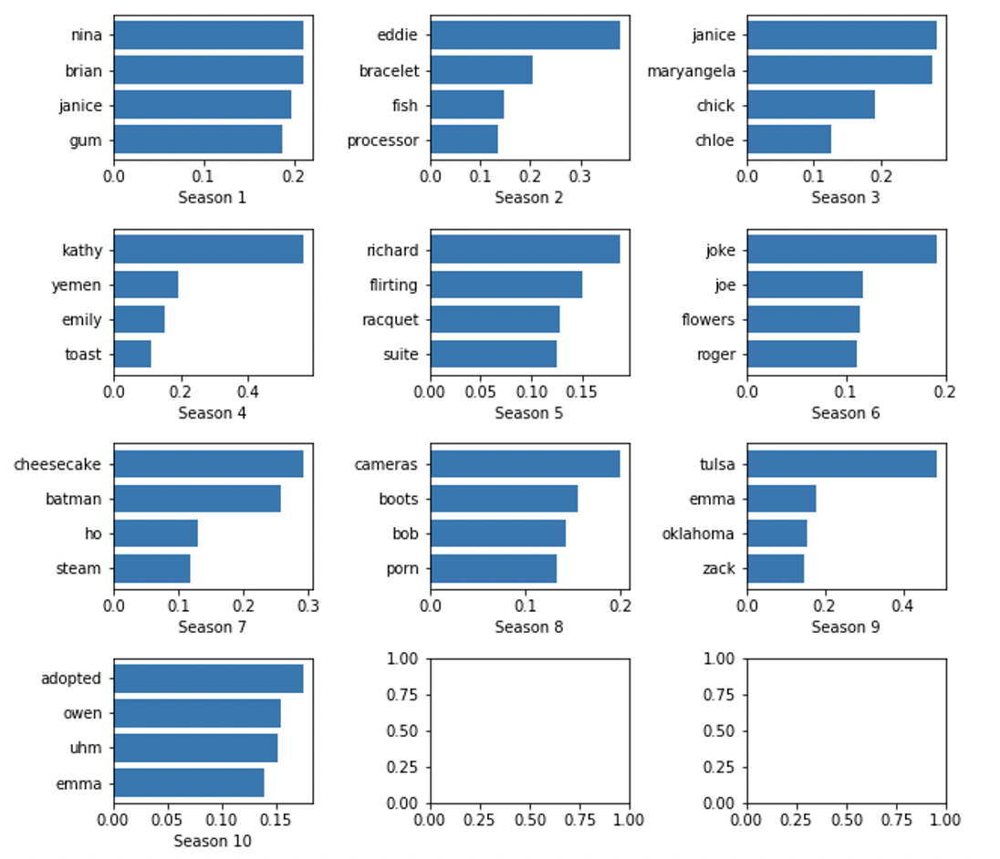
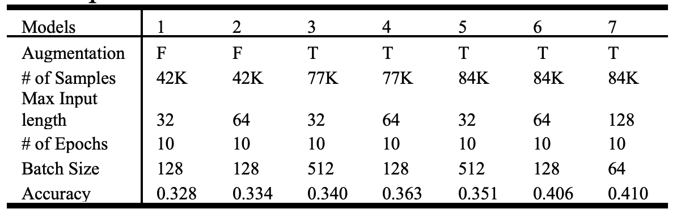
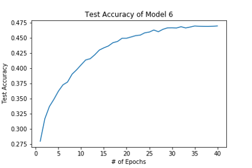
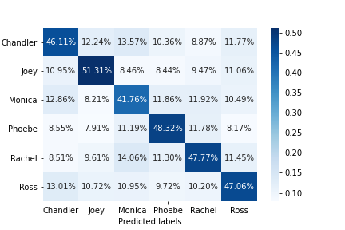
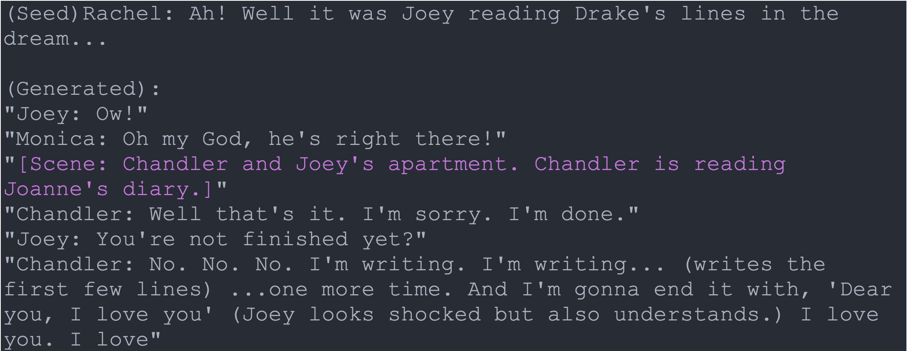
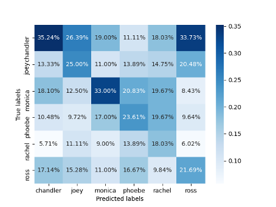

# F.R.I.E.N.D.S Dialogue Generation And Classification with GPT-2 and BERT

<!-- toc -->
#### Developer: Luping(Rachel) Zhao
This project:
 1. TF-IDF Analysis to extract the most important words of the charactors
 2. Finetuned GPT-2 with the script of F.R.I.E.N.D.S and generated new dialogues
 3. Finetuned BERT to build a multi-class classifier that maps a line to one of the friends in the sitcom
 4. Evaluated the GPT-2 generator with the multi-class classification model by comparing accuracies of the test dataset and the generated dataset.
 5. Built a web app with the classification model

<!-- toc -->

<!-- tocstop -->
## Directory structure 

```
├── README.md                         <- You are here
├── config                            <- Directory for configuration files 
│   ├── local/                        <- Directory for keeping environment variables and other local configurations that *do not sync** to Github 
│   ├── config.yaml                   <- Configurations of model pipeline
│   ├── config.py                     <- Configurations of the default value to load and save file
│
├── data/                              <- Folder that contains data used or generated.
│
├── deliverables/                     <- Slides and demo pictures of the app
│
├── EDA/                              <- EDA, data stats and tf-idf analysis results
│
├── evaluation                        <- Directory for confusion matrix files and text accuracy plots and other evaluation stats
│   ├── gpt/                          <- Directory for keeping environment variables and other local configurations that *do not sync** to Github
│   ├── max_length128batch_size64num_epoch15/   <- Evaluations of a BERT classification model
│   ├── .../                          <- Evaluations of another BERT classifications
│
├── models/                           <- Trained model objects (TMOs), and/or model summaries
│
├── src/                              <- Source data for the project 
│
├── static/                           <- Statics of the webapp
│
├── templates/                        <- htmls
│
├── src/                              <- Source data for the project 
│
├── api.py                            <- Flask wrapper for running the app 
├── run.py                            <- Simplifies the execution of src scripts for text classification 
├── generator.py                      <- Simplifies the execution of src scripts for text generation
├── requirements.txt                  <- Python package dependencies 
├── Dockerfile                        <- Dockerfile to build docker image for model pipeline
├── .gitignore                        <- .gitignore file
```

## Clone the Repository

```bash
# The repository will be download to your current working directory. 
git clone git@github.com:rachelzhaolp/F.R.I.E.N.D.S_dialogue_generator_and_classifier.git
# change working directory to the repository
cd F.R.I.E.N.D.S_dialogue_generator_and_classifier
```

## Model pipeline 

### 1.Build docker image
This command builds a docker image named `msia490` with the Dockerfile in your current working directory.
 ```bash
docker build -f Dockerfile -t msia490 .
 ```

### 2.Execute the Classification Model Pipeline 
Choose one of the options in <..> to run a step in the pipeline
```bash
docker run --mount type=bind,source="$(pwd)",target=/app/ msia490 run.py <clean_data|eda|augment|bert|gpt>
```
### 3.Run Webapp
You can build a Dockerfile for this as well
```bash
pip install -r requirements.txt 
python api.py
```


By default:
 1. `run.py bert` will train the model with `max_length=128;batch_size=64;num_epoch=15`(default values from config.yaml)
  * The evaluations of which will be saved in `evaluations/max_length128batch_size64num_epoch15/`
  * The model will be saved in `models/max_length128batch_size64num_epoch15/`
 2. Correspondingly `run.py gpt` and the webapp will load the default model

You can choose the max_length, batch_size and num_epoch of your own for your model by:
```bash
docker run --mount type=bind,source="$(pwd)",target=/app/ msia490 run.py bert --max_length=<some int> --batch_size=<some int> --num_epoch=<some int>
```
Use the same values of those args for GPT-2 evaluation and productize to specify the model to load.

### 3.Execute the Generation Model 
Choose one of the options in <> to run a  step in the pipeline; 
** note: you need tensorflow 1.x to run GPT-2** 
```bash
python generator.py <finetune|generate_sample>
```
<!-- tocstop -->

### 4. Some results
**Words that Matters**


**Story of Chandler**


**Bert Experiments**


Accuracy v.s. # of Epochs           |  Confusion Matrix
:-------------------------:|:-------------------------:
  |  

**GPT-2 Evaluation**

Sample Output:



**Confusion Matrix of the Generated text**




